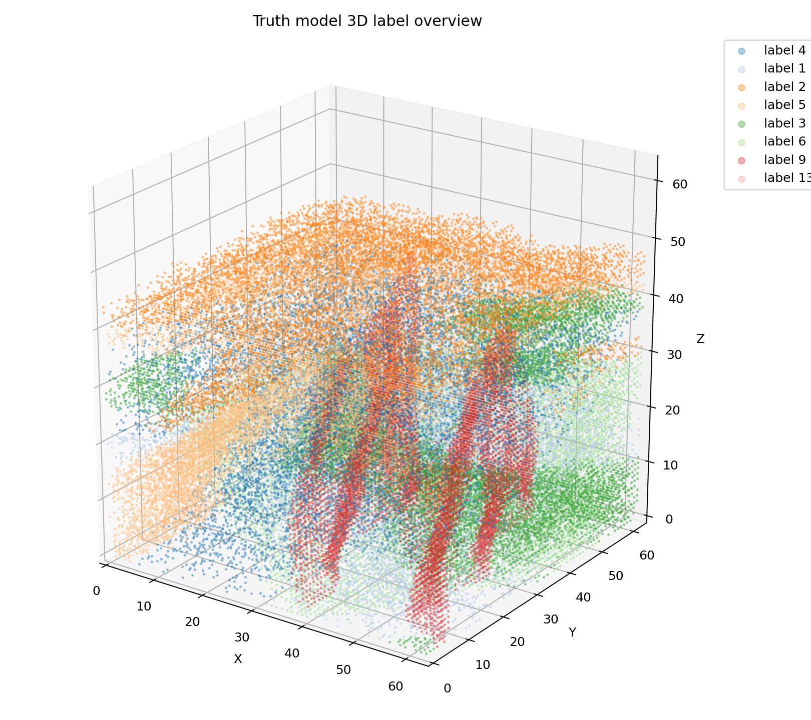
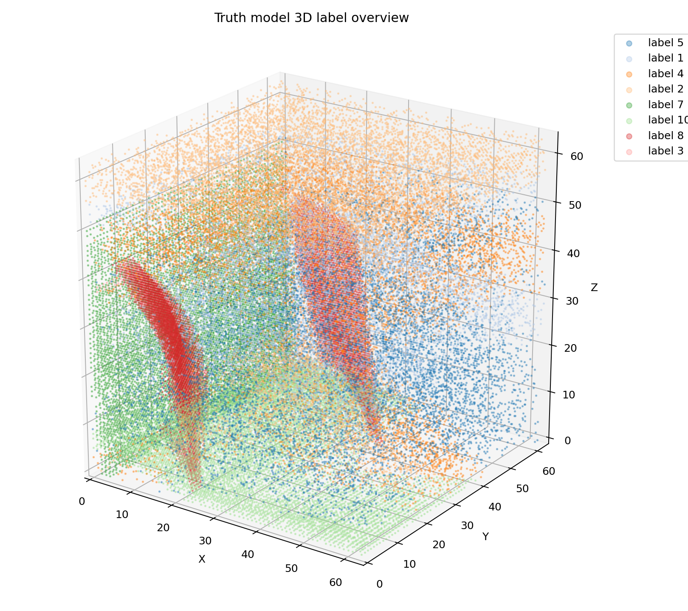
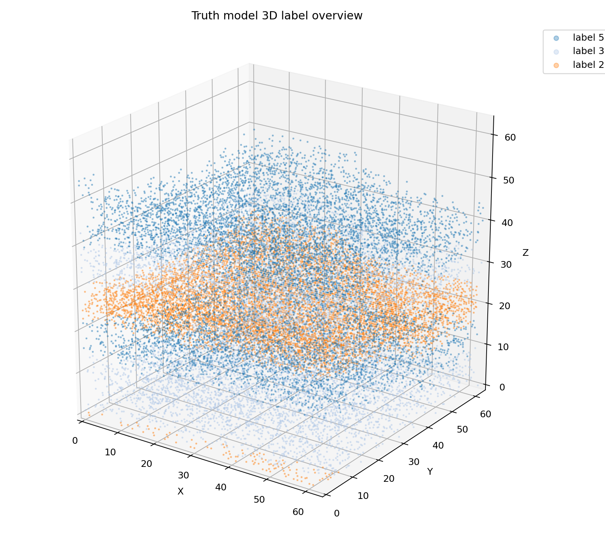
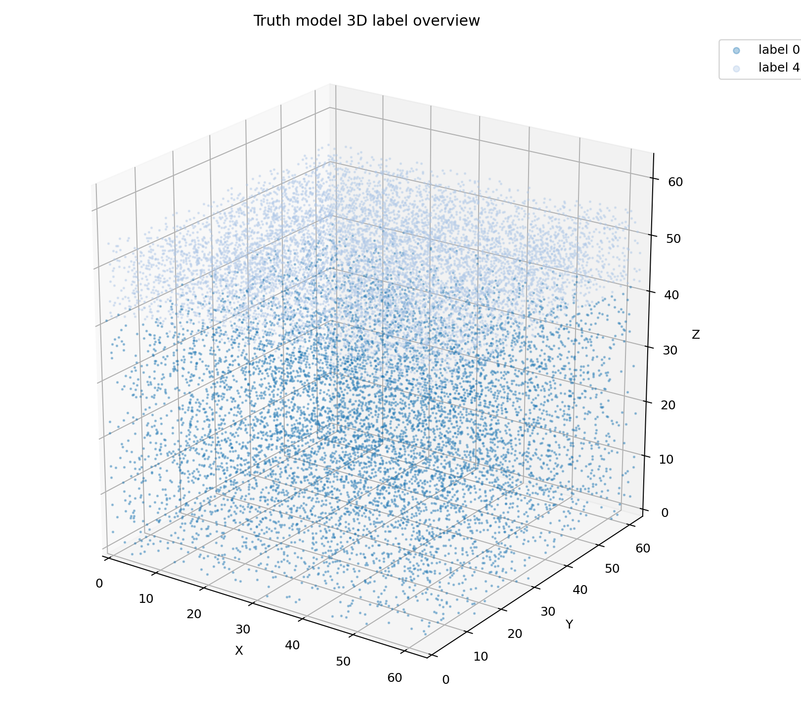
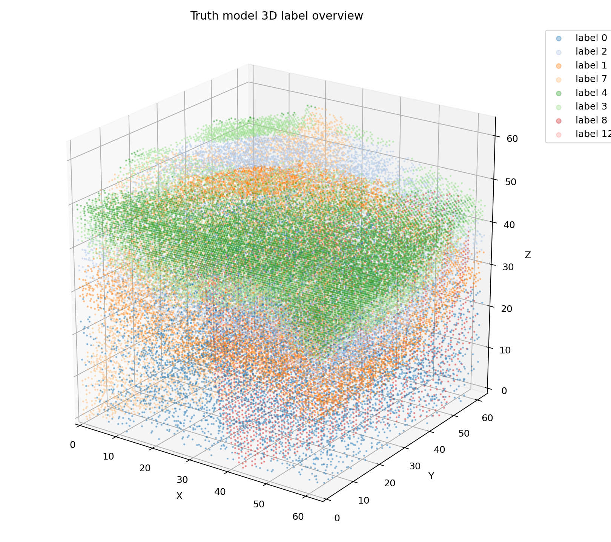

# Truth Model 3D Label QA Gallery

Inspect the 3D overview first, then open per-label 3D figures for candidate dike-like labels.

## cond_generation_0

- label summary: [cond_generation_0/label_summary.csv](cond_generation_0/label_summary.csv)
- 2D slices: [cond_generation_0/truth_model_label_slices.png](cond_generation_0/truth_model_label_slices.png)
- label MIP: [cond_generation_0/label_mip_overview.png](cond_generation_0/label_mip_overview.png)

Per-label 3D figures:

- [label_4_3d.png](cond_generation_0/label_3d/label_4_3d.png)
- [label_1_3d.png](cond_generation_0/label_3d/label_1_3d.png)
- [label_2_3d.png](cond_generation_0/label_3d/label_2_3d.png)
- [label_5_3d.png](cond_generation_0/label_3d/label_5_3d.png)
- [label_3_3d.png](cond_generation_0/label_3d/label_3_3d.png)
- [label_6_3d.png](cond_generation_0/label_3d/label_6_3d.png)
- [label_9_3d.png](cond_generation_0/label_3d/label_9_3d.png)
- [label_13_3d.png](cond_generation_0/label_3d/label_13_3d.png)

## cond_generation_1

- label summary: [cond_generation_1/label_summary.csv](cond_generation_1/label_summary.csv)
- 2D slices: [cond_generation_1/truth_model_label_slices.png](cond_generation_1/truth_model_label_slices.png)
- label MIP: [cond_generation_1/label_mip_overview.png](cond_generation_1/label_mip_overview.png)

Per-label 3D figures:

- [label_5_3d.png](cond_generation_1/label_3d/label_5_3d.png)
- [label_1_3d.png](cond_generation_1/label_3d/label_1_3d.png)
- [label_4_3d.png](cond_generation_1/label_3d/label_4_3d.png)
- [label_2_3d.png](cond_generation_1/label_3d/label_2_3d.png)
- [label_7_3d.png](cond_generation_1/label_3d/label_7_3d.png)
- [label_10_3d.png](cond_generation_1/label_3d/label_10_3d.png)
- [label_8_3d.png](cond_generation_1/label_3d/label_8_3d.png)
- [label_3_3d.png](cond_generation_1/label_3d/label_3_3d.png)

## cond_generation_2

- label summary: [cond_generation_2/label_summary.csv](cond_generation_2/label_summary.csv)
- 2D slices: [cond_generation_2/truth_model_label_slices.png](cond_generation_2/truth_model_label_slices.png)
- label MIP: [cond_generation_2/label_mip_overview.png](cond_generation_2/label_mip_overview.png)

Per-label 3D figures:

- [label_5_3d.png](cond_generation_2/label_3d/label_5_3d.png)
- [label_3_3d.png](cond_generation_2/label_3d/label_3_3d.png)
- [label_2_3d.png](cond_generation_2/label_3d/label_2_3d.png)

## cond_generation_3

- label summary: [cond_generation_3/label_summary.csv](cond_generation_3/label_summary.csv)
- 2D slices: [cond_generation_3/truth_model_label_slices.png](cond_generation_3/truth_model_label_slices.png)
- label MIP: [cond_generation_3/label_mip_overview.png](cond_generation_3/label_mip_overview.png)

Per-label 3D figures:

- [label_0_3d.png](cond_generation_3/label_3d/label_0_3d.png)
- [label_4_3d.png](cond_generation_3/label_3d/label_4_3d.png)

## paper_cond_gen_0

- label summary: [paper_cond_gen_0/label_summary.csv](paper_cond_gen_0/label_summary.csv)
- 2D slices: [paper_cond_gen_0/truth_model_label_slices.png](paper_cond_gen_0/truth_model_label_slices.png)
- label MIP: [paper_cond_gen_0/label_mip_overview.png](paper_cond_gen_0/label_mip_overview.png)

Per-label 3D figures:

- [label_0_3d.png](paper_cond_gen_0/label_3d/label_0_3d.png)
- [label_2_3d.png](paper_cond_gen_0/label_3d/label_2_3d.png)
- [label_1_3d.png](paper_cond_gen_0/label_3d/label_1_3d.png)
- [label_7_3d.png](paper_cond_gen_0/label_3d/label_7_3d.png)
- [label_4_3d.png](paper_cond_gen_0/label_3d/label_4_3d.png)
- [label_3_3d.png](paper_cond_gen_0/label_3d/label_3_3d.png)
- [label_8_3d.png](paper_cond_gen_0/label_3d/label_8_3d.png)
- [label_12_3d.png](paper_cond_gen_0/label_3d/label_12_3d.png)
