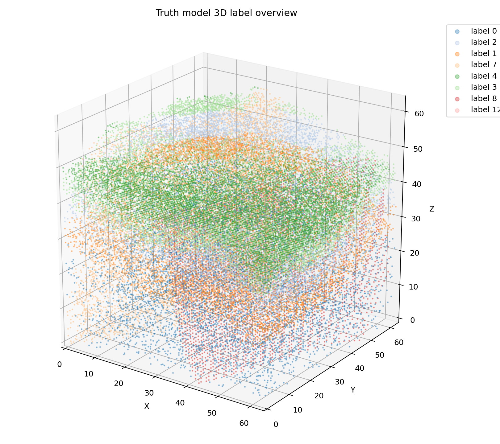

# Truth Model 3D Label QA Gallery

Inspect the 3D overview first, then open per-label 3D figures for candidate dike-like labels.

## truth_label_qa

- label summary: [label_summary.csv](label_summary.csv)
- 2D slices: [truth_model_label_slices.png](truth_model_label_slices.png)
- label MIP: [label_mip_overview.png](label_mip_overview.png)

Per-label 3D figures:

- [label_0_3d.png](label_3d/label_0_3d.png)
- [label_2_3d.png](label_3d/label_2_3d.png)
- [label_1_3d.png](label_3d/label_1_3d.png)
- [label_7_3d.png](label_3d/label_7_3d.png)
- [label_4_3d.png](label_3d/label_4_3d.png)
- [label_3_3d.png](label_3d/label_3_3d.png)
- [label_8_3d.png](label_3d/label_8_3d.png)
- [label_12_3d.png](label_3d/label_12_3d.png)
