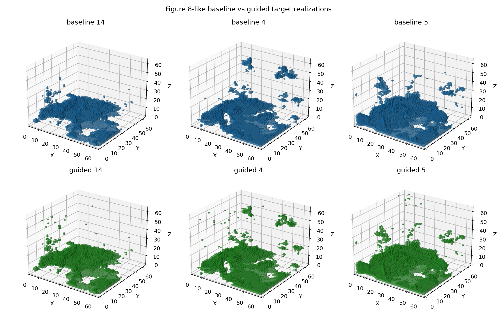
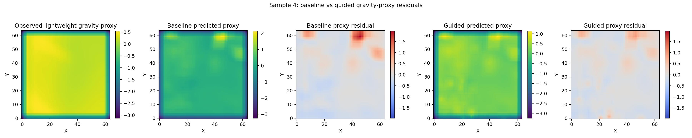

# Flowtrain：三维地质随机插值与推理期地球物理制导

Flowtrain 是一个基于 **Stochastic Interpolation / Conditional Flow Matching** 的三维离散地质建模项目。仓库包含可安装的 `flowtrain` Python 包、`64³` 无条件与稀疏钻孔条件生成流程，以及在**不重新训练模型**的前提下，将轻量可微地球物理代理加入采样过程的实验工具链。

当前版本的主要研究问题是：能否把已经训练好的条件生成模型作为地质先验，并在推理阶段利用重力、重力梯度或磁法代理观测，降低生成结果的数据失配，同时尽量保持地质合理性与钻孔条件一致性。

> [!IMPORTANT]
> 本仓库中的 `SimpleGravityForward`、`GravityGradientForward` 和 `MagneticTMIForward` 是用于方法验证、筛选和可微制导的 **lightweight geophysical proxies**。它们不是经过单位、边界条件、测量几何和噪声协方差标定的工业级正演算子；当前制导也不是严格的贝叶斯后验采样或定量地球物理反演。

## 主要能力

- 三维离散岩性数据的无条件生成与稀疏钻孔条件生成；
- 基于 3D attention U-Net 的 Flow Matching 速度场建模；
- 预训练 `64³` 无条件和条件模型的自动下载与推理；
- 对已解码地质实现进行地球物理后处理排序；
- 在采样期对连续 embedding state 施加可微地球物理梯度；
- 支持重力、重力梯度、磁法及其加权联合代理；
- 支持 absolute (`mu`) 和 relative (`alpha`) 两种制导强度定义；
- 输出逐步制导轨迹、解码变化率、CSV 指标与诊断图；
- 提供岩脉/侵入体目标的可观测性分析、目标指标、集合概率与论文图工具。

## 当前代码结构

```text
flowtrain_stochastic_interpolation-main/
├── src/flowtrain/
│   ├── interpolation/          # 随机插值及训练目标
│   ├── models/                 # 2D/3D U-Net 与条件 U-Net
│   ├── solvers/                # ODE/SDE/RK4 求解器
│   ├── dataloaders/            # 示例数据加载器
│   └── utils/                  # 通用绘图工具
├── project/
│   ├── geodata-3d-unconditional/
│   │   └── model_train_inference.py
│   └── geodata-3d-conditional/
│       ├── model_train_sh_inference_cond.py   # 条件模型训练定义
│       ├── model_inference_experiments.py     # 条件推理与测试场景生成
│       ├── geophysics.py                      # 物性映射、代理正演、失配与指标
│       ├── guided_geophysical_sampling.py     # 推理期地球物理制导采样
│       ├── evaluate_geophysics.py             # 集合排序与综合评估
│       ├── generate_observed_geophysics.py    # 合成代理观测生成
│       ├── summarize_guidance_sweep.py        # 多参数运行汇总
│       ├── evaluate_target_feature.py         # 目标岩性专属指标
│       ├── make_dike_guidance_demo.py         # 岩脉案例后处理编排
│       └── tests/                              # 地球物理与 Demo 工具测试
├── environment.yml
├── pyproject.toml
└── LICENSE.txt
```

详细的岩脉工具分工见 [`dike_guidance_demo_modules.md`](project/geodata-3d-conditional/dike_guidance_demo_modules.md)。当前实验开发过程、结果与失败分析见 [`experiment_development_report_zh.md`](project/geodata-3d-conditional/dike-demo-manual/experiment_development_report_zh.md)。

## 安装

### 推荐：Conda 环境

要求：Python `>=3.10,<3.13`。仓库提供的环境固定为 Python 3.12、NumPy 1.26 和 PyTorch 2.8，以避免 NumPy 2.x 与部分 Matplotlib/Lightning 二进制包不兼容。

```bash
git clone https://github.com/MMMCCY/flowtrain_stochastic_interpolation-main.git
cd flowtrain_stochastic_interpolation-main

conda env create -f environment.yml
conda activate geoflow
```

检查安装和计算设备：

```bash
python -c "import torch, flowtrain; print('torch:', torch.__version__); print('cuda:', torch.cuda.is_available())"
```

`environment.yml` 使用 PyTorch CUDA 12.8 wheel。若机器没有兼容的 NVIDIA 驱动/GPU，请按照 [PyTorch 官方安装方式](https://pytorch.org/get-started/locally/)替换 PyTorch 安装，其他依赖仍可沿用。

### 仅安装 Python 包

```bash
python -m pip install -e .
```

安装过程会从 GitHub 安装 [StructuralGeo / GeoGen v1.0](https://github.com/eldadHaber/StructuralGeo/releases/tag/v1.0)。训练与首次下载预训练权重需要网络连接。

## 快速开始

以下命令均从仓库根目录执行。

### 1. 无条件推理

```bash
python project/geodata-3d-unconditional/model_train_inference.py \
  --mode inference \
  --n-samples 8 \
  --batch-size 2 \
  --seed 100 \
  --infer-device cuda
```

没有提供 `--checkpoint-path` 时，脚本会把预训练权重下载到 `project/geodata-3d-unconditional/demo_model/`。CPU 可用，但 `64³` 三维推理通常很慢。

训练入口仍在同一脚本中：

```bash
python project/geodata-3d-unconditional/model_train_inference.py \
  --mode train \
  --train-devices 0,1
```

### 2. 稀疏钻孔条件推理

```bash
PYTHONPATH=. python project/geodata-3d-conditional/model_inference_experiments.py \
  --n-scenarios 1 \
  --n-samples 4 \
  --no-display
```

脚本会生成测试地质模型和稀疏钻孔条件，再输出 `sol_*.pt` 实现。典型场景目录为：

```text
project/geodata-3d-conditional/samples/generative-conditional-3d/
└── conditional_gen_demo_0/
    ├── true_model.pt
    ├── boreholes.pt
    └── sol_*.pt
```

这里的 `PYTHONPATH=.` 用于兼容脚本当前的 `src.flowtrain` 导入方式。也可查看 [`inference_demo.ipynb`](project/geodata-3d-conditional/inference_demo.ipynb)。当前 `model_inference_experiments.py` 的 `main()` 会显式把条件推理设备设为 CPU；需要 GPU 的制导采样请使用后文 `guided_geophysical_sampling.py --device cuda`。

## 地球物理模块

当前实现分为三个相互独立但可组合的层次：

1. **后处理评价**：不改变生成过程，对已有 `sample_*.pt`、`sol_*.pt` 或 `run_*.pt` 排序和统计；
2. **采样期制导**：不改变训练损失和网络结构，在 Euler 采样速度上加入地球物理梯度；
3. **案例与论文图工具**：从已保存的 baseline/guided ensemble 生成目标指标、可观测性分析和图件。

### 代理正演与指标

[`geophysics.py`](project/geodata-3d-conditional/geophysics.py) 提供：

| 组件 | 作用 |
|---|---|
| `LithologyPropertyMap` | 离散岩性编号映射为密度差或磁化率等标量物性 |
| `SimpleGravityForward` | 按深度卷积并累加的二维地表重力代理 |
| `GravityGradientForward` | 基于重力代理的梯度响应 |
| `MagneticTMIForward` | 轻量总磁场异常代理 |
| `normalized_misfit` | 预测场与观测场的归一化失配 |
| `rank_realizations_by_geophysics` | 保持兼容的实现排序 API |
| `voxel_accuracy`, `mean_iou` | truth 已知时的地质重建指标 |
| `spearman_correlation` | 无 SciPy/sklearn 依赖、支持 ties 的秩相关 |

默认岩性—物性值只适合筛选演示。可使用 `density_config.json` 和 `susceptibility_config.json` 明确记录项目物性假设。

### 制导如何工作

采样状态 `x` 是形状为 `[B,E,X,Y,Z]` 的连续岩性 embedding。首先利用 embedding 向量的余弦相似度进行 soft decode：

```text
p_k(x) = softmax(cos(x, e_k) / tau)
m(x)   = Σ_k p_k(x) · property_k
```

随后将期望物性体送入一个或多个可微代理正演，并计算加权失配：

```text
L_geo = λ_g L_gravity + λ_gg L_gravity_gradient + λ_m L_magnetic
```

对连续状态求梯度后，制导速度有两种定义：

```text
absolute: v_geo = mu · w(t) · ∇x L_geo

relative: v_geo = alpha · w(t) · ||v_prior|| · ∇x L_geo / (||∇x L_geo|| + eps)

x_next = x + dt · (v_prior - v_geo)
```

- `mu` 是依赖梯度原始尺度的绝对强度；
- `alpha` 把制导速度约束为先验速度范数的一定比例，更便于跨运行比较；
- `w(t)` 可选 `late_quadratic`、`quadratic` 或 `constant_after_start`；
- `tau` 控制 soft category probability 的平滑程度；
- `grad_clip_norm` 对每个样本的地球物理梯度裁剪；
- `v_prior` 在 `no_grad` 下计算，梯度只通过 soft decode → 物性映射 → 代理正演链路传播。

最终结果继续使用原项目的解码约定：

```python
decoded = model.decode(final_state) - 1
```

因此输出类别仍位于评价脚本所期望的 `-1, 0, 1, ...` 标签空间。

## 地球物理制导：可复现实例

下面以单个条件场景和重力代理为例。`alpha` 数值仅用于展示命令结构，不代表对新数据的最优设置。

```bash
PROJECT=project/geodata-3d-conditional
CASE=$PROJECT/samples/generative-conditional-3d/conditional_gen_demo_0
CKPT=$PROJECT/demo_model/conditional-weights.ckpt
RUNS=$PROJECT/guided-results/example
```

### 1. 建立同 seed 的无制导基线

相对模式下 `alpha=0` 等价于不施加制导修正，但仍记录同一套诊断量：

```bash
python $PROJECT/guided_geophysical_sampling.py \
  --ckpt-path $CKPT \
  --samples-dir $CASE \
  --output-dir $RUNS/alpha_0 \
  --n-samples 16 \
  --n-steps 32 \
  --physics-mode gravity \
  --guidance-mode relative \
  --alpha 0 \
  --seed 42 \
  --device cuda
```

### 2. 运行相对强度制导

使用相同 seed，并传入基线目录，以便统计逐样本解码标签变化率：

```bash
python $PROJECT/guided_geophysical_sampling.py \
  --ckpt-path $CKPT \
  --samples-dir $CASE \
  --output-dir $RUNS/alpha_0_05 \
  --n-samples 16 \
  --n-steps 32 \
  --physics-mode gravity \
  --guidance-mode relative \
  --alpha 0.05 \
  --tau 0.1 \
  --guidance-start 0.5 \
  --guidance-schedule late_quadratic \
  --grad-clip-norm 1.0 \
  --baseline-dir $RUNS/alpha_0 \
  --seed 42 \
  --device cuda
```

absolute 模式使用 `--guidance-mode absolute --mu <value>`。此时 `alpha` 不生效；relative 模式中 `mu` 不生效。

### 3. 评价生成结果

```bash
python $PROJECT/evaluate_geophysics.py \
  --samples-dir $RUNS/alpha_0_05 \
  --truth-model $CASE/true_model.pt \
  --boreholes $CASE/boreholes.pt \
  --observed-gravity $RUNS/alpha_0_05/observed_gravity.pt \
  --output-dir $RUNS/alpha_0_05/evaluation \
  --save-csv \
  --save-plots \
  --device cpu
```

评价输出包括：

- `geo_misfit` 与地球物理排序；
- `voxel_accuracy`、`mean_iou`；
- 可选 `borehole_consistency`；
- 可选 `magnetic_proxy_misfit`、`gravity_gradient_proxy_misfit` 和 `joint_proxy_misfit`；
- `metrics.csv`、最好/最差样本切片、代理场与相关性散点图。

只测试评价代码，不读取真实结果：

```bash
python $PROJECT/evaluate_geophysics.py --demo
```

## 自定义物性与多物理场制导

### 1. 创建受控物性配置

target label 应先通过 truth label 可视化人工确认，避免把自动猜测的类别用于研究结论。

```bash
python $PROJECT/create_density_config.py \
  --truth-model $CASE/true_model.pt \
  --target-label 10 \
  --target-density 3.5 \
  --output-json $RUNS/density_config.json

python $PROJECT/create_susceptibility_config.py \
  --truth-model $CASE/true_model.pt \
  --target-label 10 \
  --target-susceptibility 5.0 \
  --output-json $RUNS/susceptibility_config.json
```

### 2. 生成合成代理观测

```bash
python $PROJECT/generate_observed_geophysics.py \
  --truth-model $CASE/true_model.pt \
  --density-config $RUNS/density_config.json \
  --susceptibility-config $RUNS/susceptibility_config.json \
  --physics-mode joint \
  --output-dir $RUNS/observed \
  --device cpu
```

这会生成 `observed_gravity.pt`、`observed_gravity_gradient.pt`、`observed_magnetic.pt`、对应 PNG 和 `manifest.json`。

### 3. 联合制导

```bash
python $PROJECT/guided_geophysical_sampling.py \
  --ckpt-path $CKPT \
  --samples-dir $CASE \
  --density-config $RUNS/density_config.json \
  --susceptibility-config $RUNS/susceptibility_config.json \
  --observed-gravity $RUNS/observed/observed_gravity.pt \
  --observed-gravity-gradient $RUNS/observed/observed_gravity_gradient.pt \
  --observed-magnetic $RUNS/observed/observed_magnetic.pt \
  --physics-mode joint \
  --gravity-weight 1.0 \
  --gravity-gradient-weight 0.25 \
  --magnetic-weight 1.0 \
  --guidance-mode relative \
  --alpha 0.05 \
  --output-dir $RUNS/joint_alpha_0_05 \
  --n-samples 16 \
  --n-steps 32 \
  --seed 42 \
  --device cuda
```

`--physics-mode` 可设为 `gravity`、`gravity_gradient`、`magnetic` 或 `joint`。使用外部观测时，必须保证观测张量、网格、归一化方式和物性配置与当前代理正演一致；否则失配数值没有可比较意义。

## 参数扫描与汇总

每组运行完成评价后，可递归汇总各目录中的 `metrics.csv`：

```bash
python $PROJECT/summarize_guidance_sweep.py \
  --root-dir $RUNS \
  --output-csv $RUNS/guidance_sweep_summary.csv

python $PROJECT/plot_guidance_sweep.py \
  --summary-csv $RUNS/guidance_sweep_summary.csv \
  --output-dir $RUNS/sweep_plots
```

比较不同强度时应保持 checkpoint、truth、boreholes、初始 seed、步数、物性配置和观测场不变。推荐先运行 `alpha=0`，再让所有 relative-guidance 运行通过 `--baseline-dir` 与它配对。

## 岩脉/侵入体目标评价

全局 voxel accuracy 或 mean IoU 可能掩盖小体积目标的变化。目标类别确认后，可单独计算 IoU、precision、recall、F1、体积误差、质心距离、连通分量和集合概率：

```bash
python $PROJECT/evaluate_target_feature.py \
  --samples-dir $RUNS/alpha_0_05 \
  --truth-model $CASE/true_model.pt \
  --target-label 10 \
  --metrics-csv $RUNS/alpha_0_05/evaluation/metrics.csv \
  --output-dir $RUNS/alpha_0_05/target_label_10
```

从已有 baseline/guided 结果组装完整案例：

```bash
python $PROJECT/make_dike_guidance_demo.py \
  --baseline-dir $RUNS/alpha_0 \
  --guided-dir $RUNS/alpha_0_05 \
  --truth-model $CASE/true_model.pt \
  --boreholes $CASE/boreholes.pt \
  --density-config $RUNS/density_config.json \
  --target-label 10 \
  --output-dir $RUNS/dike_demo \
  --device cpu
```

一个已保存案例的目标集合与重力代理残差图如下。它们用于展示工具链输出，不代表所有 case 都会获得同等改善。





## 采样与评价输出约定

| 文件 | 内容 |
|---|---|
| `sample_<id>.pt` | 解码后的离散岩性，兼容 `evaluate_geophysics.py` |
| `observed_gravity.pt` | 本次使用或由 truth 合成的重力代理观测 |
| `observed_gravity_gradient.pt` | 可选重力梯度代理观测 |
| `observed_magnetic.pt` | 可选磁法代理观测 |
| `guided_trace.csv` | 每个样本、每个 Euler step 的 loss、速度范数与有效制导比例 |
| `decoded_change_ratio.csv` | 提供 `--baseline-dir` 时的逐样本标签变化比例 |
| `config.json` | checkpoint、输入、seed、参数、物性和观测来源 |
| `evaluation/metrics.csv` | 每个实现的地球物理、地质和钻孔一致性指标 |

评价工具可读取 `[X,Y,Z]`、`[1,X,Y,Z]` 和 `[1,1,X,Y,Z]` 单样本张量，并统一为 `[B,1,X,Y,Z]`。默认搜索前缀为 `sample_`、`sol_` 和 `run_`。

## 测试

`pytest` 是可选的开发依赖，不包含在运行时依赖中。首次运行测试前安装：

```bash
python -m pip install pytest
```

运行地球物理与岩脉工具测试：

```bash
python -m pytest project/geodata-3d-conditional/tests/test_dike_demo_tools.py -q
```

运行关键脚本的静态语法检查：

```bash
python -m py_compile \
  project/geodata-3d-conditional/geophysics.py \
  project/geodata-3d-conditional/guided_geophysical_sampling.py \
  project/geodata-3d-conditional/evaluate_geophysics.py
```

长时间采样前建议先检查：

```bash
python -c "import torch; print(torch.cuda.is_available(), torch.cuda.device_count())"
```

不要在纯 CPU 环境并行启动多组 `64³` guided runs；单组 16 样本、32 步的三维制导也可能耗时很长。

## 当前结果应如何解读

- 后处理排序回答的是“哪些已生成实现更符合代理观测”；
- 采样期制导回答的是“代理梯度能否改变生成轨迹并降低代理失配”；
- truth-based accuracy/IoU 只适用于合成实验，真实应用中不可获得；
- `alpha=0` 和 `alpha>0` 只有在输入、seed 与配置一致时才能进行 paired comparison；
- 低地球物理代理失配不自动等价于更准确的三维地质结构；
- 当前已保存实验中，gravity-only 对代理失配有弱正向证据，但目标岩性 IoU/recall 的改善通常较小；magnetic/joint/gravity-gradient 扩展尚未表现出稳定优势。

更完整的证据和负结果请阅读 [`geophysical_guidance_failure_analysis.md`](project/geodata-3d-conditional/geophysical_guidance_failure_analysis.md) 与 [`experiment_development_report_zh.md`](project/geodata-3d-conditional/dike-demo-manual/experiment_development_report_zh.md)。

## 预训练权重

首次运行基础推理脚本时会自动下载 v1.0.0 权重，也可手动下载：

- [conditional-weights.ckpt](https://github.com/chipnbits/flowtrain_stochastic_interpolation/releases/download/v1.0.0/conditional-weights.ckpt)
- [unconditional-weights.ckpt](https://github.com/chipnbits/flowtrain_stochastic_interpolation/releases/download/v1.0.0/unconditional-weights.ckpt)

`guided_geophysical_sampling.py` 不自动下载权重，必须显式提供 `--ckpt-path`。

## 引用与许可

项目的随机插值实现参考：

> Albergo, M. S., Boffi, N. M., & Vanden-Eijnden, E. [*Stochastic Interpolants: A Unifying Framework for Flows and Diffusions*](https://arxiv.org/abs/2303.08797). arXiv:2303.08797.

项目归档： [](https://doi.org/10.5281/zenodo.16924445)

代码采用 [MIT License](LICENSE.txt)。
